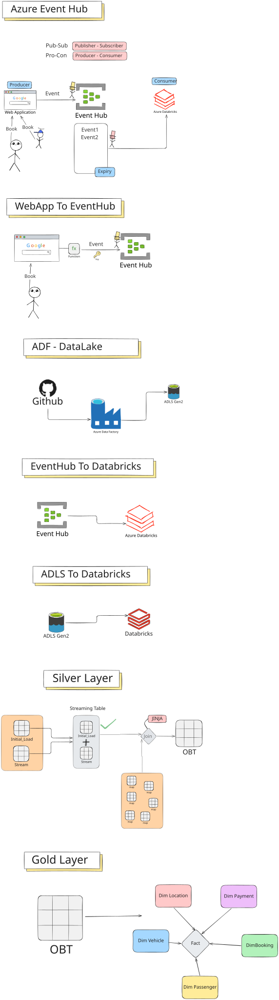
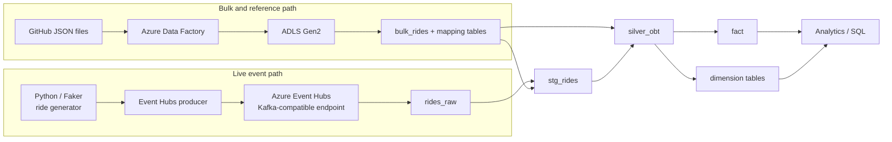
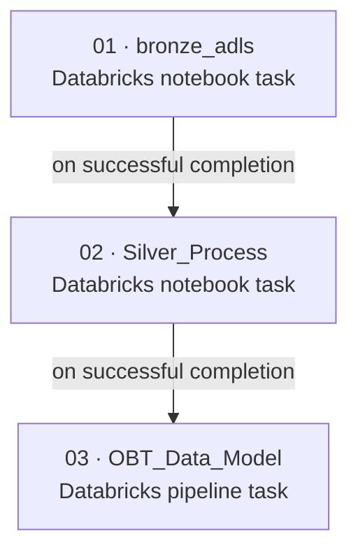
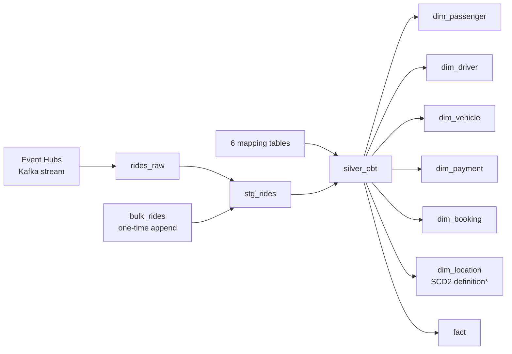
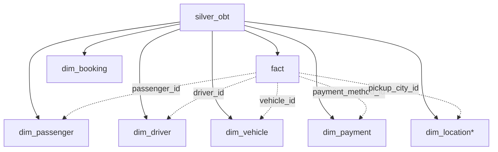

<div align="center">

# Azure Real-Time Ride Streaming Platform

### End-to-End Data Engineering | Event Streaming | Lakehouse | Workflow Orchestration | Dimensional Modeling

**Azure Event Hubs · Azure Data Factory · ADLS Gen2 · Azure Databricks · PySpark · Delta Lake · SQL**

[](https://azure.microsoft.com/)
[](https://www.databricks.com/)
[](https://spark.apache.org/)
[](https://delta.io/)
[](https://www.python.org/)

**[Architecture](#architecture) · [Full orchestration](#full-orchestration) · [Data model](#analytics-and-dimensional-model) · [Getting started](#getting-started) · [Source code](Code_Files/)**

</div>

---

## Overview

An end-to-end **Azure data engineering portfolio project** that demonstrates how synthetic ride-booking events can move from an application into a streaming lakehouse and become analytics-ready fact and dimension tables. It brings together a live Event Hubs ingestion path, a bulk/reference-data path through Azure Data Factory and ADLS Gen2, Databricks Lakeflow Spark Declarative Pipelines, and a multi-task Databricks job for execution order.

The project was developed as a hands-on implementation of a real-time ride analytics use case, with **PySpark Structured Streaming, SQL enrichment, Delta tables, change-data-capture (CDC) flow definitions, and dimensional modeling**.

> **Dataset disclaimer:** The ride bookings, names, addresses, and fares are synthetically generated for demonstration. This is an independent educational portfolio project, not an official Uber service or actual Uber operational dataset.

### Engineering highlights

| Capability | Implementation |
| --- | --- |
| Streaming transport | Azure Event Hubs using its Kafka-compatible endpoint |
| Event generation | Python + Faker ride generator; Event Hubs Python producer |
| Batch/reference ingestion | JSON reference and bulk data through an Azure Data Factory → ADLS Gen2 path |
| Stream processing | Databricks PySpark Structured Streaming |
| Historical + live convergence | Separate one-time and streaming append flows targeting `stg_rides` |
| Enrichment | SQL joins to six mapping tables, producing `silver_obt` |
| Analytics model | Ride fact table plus passenger, driver, vehicle, payment, booking, and location model definitions |
| Workflow orchestration | Databricks job: `bronze_adls` → `Silver_Process` → `OBT_Data_Model` |
| Query layer | SQL against the `uber.bronze` tables in the documented workspace |

## Architecture



Two ingestion paths converge in Databricks: **event streaming** and **bulk/reference data**. They are intentionally shown separately because they have different arrival patterns and processing responsibilities.



**Logical processing pattern:** source events → Bronze/raw ingestion → parsed staging → Silver/OBT enrichment → fact and dimensions. The committed project uses the catalog/schema `uber.bronze` for the demonstrated tables; it does **not** publish separate catalog schemas named `silver` and `gold`.

## Full orchestration

### 1. Databricks job: end-to-end task dependency graph

The Databricks **Jobs & Pipelines** workflow shown in the project uses three tasks with explicit upstream-to-downstream ordering:



| Order | Task name in job | Task type shown | Responsibility | Repository artifact |
| --- | --- | --- | --- | --- |
| 1 | `bronze_adls` | Notebook | Prepare/load ADLS-backed bulk rides and mapping/reference datasets into the Databricks Bronze area. | [`Code_Files/bronze_adls.ipynb`](Code_Files/bronze_adls.ipynb), [`Data/`](Data/) |
| 2 | `Silver_Process` | Notebook | Execute the Silver/OBT preparation workflow and metadata-driven transformation work needed by the model. | [`Code_Files/silver_obt.ipynb`](Code_Files/silver_obt.ipynb), [`Code_Files/Silver_Obt.sql`](Code_Files/Silver_Obt.sql) |
| 3 | `OBT_Data_Model` | Pipeline | Invoke the `uber_ride_ingest` Lakeflow pipeline to process streaming ingestion, staging, OBT, and dimensional-model definitions. | [`Code_Files/ingest.py`](Code_Files/ingest.py), [`silver.py`](Code_Files/silver.py), [`Silver_Obt.sql`](Code_Files/Silver_Obt.sql), [`model.py`](Code_Files/model.py) |

**Execution semantics:** the notebook tasks establish the upstream datasets/preparation work; the downstream pipeline task performs its update once dependencies complete successfully. A failed upstream task should be investigated before rerunning the dependent step. The captured Jobs screen showed **no schedule or trigger configured**, so this README does not claim an automated recurring schedule, continuous job trigger, deployment pipeline, or GitHub Actions CI/CD.

### 2. Inside the `uber_ride_ingest` Lakeflow pipeline

The pipeline graph shows how Spark resolves dependencies between streaming tables, views, reference tables, and modeled outputs:



**The two orchestration levels are distinct:**

- **Job-level:** task ordering across notebook preparation and the pipeline invocation.
- **Pipeline-level:** table/view dependencies calculated from `spark.readStream.table(...)`, SQL source tables, append flows, and `create_auto_cdc_flow(...)` declarations.

The source definitions use `from pyspark import pipelines as dp`. Their intended processing logic is summarized below.

### 3. Stage-by-stage operational flow

#### Stage A — Generate and publish ride events

1. [`data.py`](data.py) creates synthetic ride records with IDs, booking/pickup/drop-off timestamps, passengers, drivers, vehicle identifiers, locations, distances, fares, payment method IDs, and ride statuses.
2. [`connection.py`](connection.py) serializes a ride record and sends it to Azure Event Hubs with `EventHubProducerClient`.
3. [`api.py`](api.py) exposes a small FastAPI booking entry point that calls the generator/producer. The producer can also be run directly from the terminal.

**Output:** JSON ride events in the configured Event Hub.

#### Stage B — Load bulk rides and reference mappings

The data files under [`Data/`](Data/) supply the one-time bulk sample and descriptive reference lookups:

| Input | Usage |
| --- | --- |
| `bulk_rides.json` | Initial/historical ride load |
| `map_cities.json` | City, state, and region lookup |
| `map_vehicle_makes.json` | Vehicle make lookup |
| `map_vehicle_types.json` | Vehicle type and rate attributes |
| `map_payment_methods.json` | Payment method attributes |
| `map_ride_statuses.json` | Ride status labels |
| `map_cancellation_reasons.json` | Cancellation reason labels |

The `bronze_adls` notebook corresponds to the ADLS/Bronze preparation step. The Azure Data Factory and ADLS Gen2 resources are external cloud configuration; cloning this repository does not provision or execute them automatically.

#### Stage C — Ingest the live stream into `rides_raw`

[`Code_Files/ingest.py`](Code_Files/ingest.py) reads the Event Hubs Kafka endpoint with `spark.readStream.format("kafka")`. Its `rides_raw` definition retains the Kafka event metadata and casts the binary `value` payload into a string column named `rides` for parsing.

**Output:** `rides_raw`.

#### Stage D — Combine historical and incoming rides in `stg_rides`

[`Code_Files/silver.py`](Code_Files/silver.py) declares a typed `rides_schema`, creates a shared streaming target named `stg_rides`, and defines **two separate append flows**:

```python
# Initial historical data: runs once for the pipeline flow.
@dp.append_flow(target="stg_rides", once=True)
def rides_bulk():
    ...

# Ongoing events: parse the rides JSON from rides_raw.
@dp.append_flow(target="stg_rides")
def rides_stream():
    ...
```

The bulk path reads `bulk_rides` and casts `booking_timestamp` to a timestamp. The streaming path parses the `rides` JSON using `from_json(...)` and selects the structured event fields. Both append into `stg_rides`; they are not separate final reporting tables.

**Output:** `stg_rides`.

#### Stage E — Build the enriched operational business table (OBT)

[`Code_Files/Silver_Obt.sql`](Code_Files/Silver_Obt.sql) declares `silver_obt` as a **streaming table** sourced from `STREAM(uber.bronze.stg_rides)`. It enriches ride records through left joins against the six mapping tables and defines a **three-minute watermark on `booking_timestamp`**.

Examples of the resulting attributes include pickup city, region, state, vehicle type/make, rate fields, payment description, ride status, and cancellation reason.

**Output:** `silver_obt`, the enriched input to the analytics model.

#### Stage F — Define fact and dimension CDC flows

[`Code_Files/model.py`](Code_Files/model.py) reads `silver_obt`, projects analytical entities, declares streaming targets, and configures `dp.create_auto_cdc_flow(...)`.

**Declared targets:** `fact`, `dim_passenger`, `dim_driver`, `dim_vehicle`, `dim_payment`, `dim_booking`, and `dim_location`.

The code declares **SCD Type 1** flows for the fact and most dimensions, plus an **SCD Type 2** location flow. See [Data model](#analytics-and-dimensional-model) and [Implementation checks](#implementation-checks-and-limitations) for the precise limitation in the committed location SQL lineage.

#### Stage G — Query analytics-ready tables

After the appropriate table updates complete, SQL can join the fact to dimensions to analyze ride counts, fares, payment mix, and regional activity. Example queries appear below.

### 4. How to operate and validate the workflow

1. Verify that the Event Hub, ADLS Gen2 storage, Azure Data Factory resources, and Databricks workspace are available and authorized.
2. Confirm the bulk ride input and **all six** reference/mapping tables can be queried in the target Databricks catalog/schema.
3. Confirm the Databricks pipeline references the correct source files and has a valid secure Event Hubs credential configuration.
4. In **Jobs & Pipelines**, inspect the three-task dependency graph and trigger a job run when the upstream data is prepared.
5. Open the job run to inspect each task's success/failure and logs. An upstream failure should be addressed before analyzing downstream results.
6. Open the `uber_ride_ingest` pipeline's **Tables** and **Pipeline graph** tabs to inspect the streaming targets individually. A successful dry run/validation alone does not establish that all tables were materialized.
7. Confirm target availability and schema in a Databricks SQL notebook:

```sql
SHOW TABLES IN uber.bronze;
DESCRIBE TABLE uber.bronze.stg_rides;
DESCRIBE TABLE uber.bronze.silver_obt;
DESCRIBE TABLE uber.bronze.fact;
```

Additional data checks:

```sql
SELECT COUNT(*) AS staged_rides FROM uber.bronze.stg_rides;
SELECT COUNT(*) AS enriched_rides FROM uber.bronze.silver_obt;
SELECT COUNT(*) AS modeled_rides FROM uber.bronze.fact;
```

> **Operational note:** Counts depend on the bulk file, live events, deduplication, and current pipeline state. No fixed throughput, latency, job SLA, cost, or production reliability figures are claimed.

## Analytics and dimensional model

The OBT serves as the common enriched input from which the analytical entities are projected.



| Table | Intended analytical grain / contents | Flow declared in `model.py` |
| --- | --- | --- |
| `fact` | Ride measures and dimensional identifiers | Type 1 |
| `dim_passenger` | Passenger ID and descriptive/contact attributes | Type 1 |
| `dim_driver` | Driver ID, rating, and descriptive attributes | Type 1 |
| `dim_vehicle` | Vehicle ID, type, make, and model details | Type 1 |
| `dim_payment` | Payment method and authorization flags | Type 1 |
| `dim_booking` | Booking ID, status, timestamps, and pickup/drop-off details | Type 1 |
| `dim_location` | Pickup city, state, and region, with changes over time | Type 2 definition* |

Example analytics query — total fares by payment method:

```sql
SELECT
    p.payment_method,
    COUNT(*) AS ride_count,
    ROUND(SUM(f.total_fare), 2) AS total_fare
FROM uber.bronze.fact AS f
LEFT JOIN uber.bronze.dim_payment AS p
    ON f.payment_method_id = p.payment_method_id
GROUP BY p.payment_method
ORDER BY total_fare DESC;
```

Example analytics query — base fare by region **after `dim_location` is materialized**:

```sql
SELECT
    f.ride_id,
    f.base_fare,
    loc.region
FROM uber.bronze.fact AS f
LEFT JOIN uber.bronze.dim_location AS loc
    ON f.pickup_city_id = loc.pickup_city_id;
```

For Type 2 analysis across historical location versions, refine the join using appropriate effective-date/version logic; a city-ID-only join can match multiple versions.

## Repository structure

```text
Azure-Real-Time-Ride-Streaming-Platform/
├── Code_Files/
│   ├── ingest.py               # Event Hubs Kafka -> rides_raw
│   ├── silver.py               # one-time + streaming append -> stg_rides
│   ├── Silver_Obt.sql          # enriched silver_obt streaming table
│   ├── model.py                # fact and dimension CDC flow definitions
│   ├── bronze_adls.ipynb       # ADLS/Bronze preparation notebook
│   └── silver_obt.ipynb        # Silver / OBT development notebook
├── Data/
│   ├── bulk_rides.json
│   ├── map_cities.json
│   ├── map_cancellation_reasons.json
│   ├── map_payment_methods.json
│   ├── map_ride_statuses.json
│   ├── map_vehicle_makes.json
│   └── map_vehicle_types.json
├── templates/
│   └── home.html
├── api.py                      # FastAPI booking demo
├── connection.py               # Event Hubs producer
├── data.py                     # Faker-based ride generator
├── files_array.json            # input-file mapping configuration
├── Uber_Project.svg            # architecture illustration
├── pyproject.toml
├── uv.lock
├── requirements.txt
├── .gitignore
└── README.md
```

## Getting started

### Prerequisites

- Python **3.12+**, as declared in `pyproject.toml`.
- An Azure Event Hubs namespace and event hub, with appropriate permissions.
- An Azure Databricks workspace supporting the pipeline APIs used in the project.
- ADLS Gen2 and Azure Data Factory resources if reproducing the bulk/reference path.
- Permissions to create/read the required Databricks tables; the current SQL examples use `uber.bronze`.

### Clone and install local dependencies

```bash
git clone https://github.com/nazishatta/Azure-Real-Time-Ride-Streaming-Platform.git
cd Azure-Real-Time-Ride-Streaming-Platform
uv sync
```

Alternatively, use a Python 3.12+ virtual environment and install dependencies from `requirements.txt`.

### Configure the local producer

Create a local, **untracked** `.env` file:

```dotenv
CONNECTION_STRING=<your-rotated-event-hubs-connection-string>
EVENT_HUBNAME=<your-event-hub-name>
```

[`connection.py`](connection.py) reads `CONNECTION_STRING` and `EVENT_HUBNAME` from the environment. Never commit the real connection string or access keys. The Databricks consumer is a separate runtime and needs its own appropriately configured secure `EVENT_HUB_CONNECTION_STRING` setting, consistent with [`Code_Files/ingest.py`](Code_Files/ingest.py).

Run a sample producer invocation:

```bash
uv run python connection.py
```

### Recreate the Databricks workflow

1. Load the bulk ride file and reference tables through the project's ADLS/ADF path or an equivalent authorized Databricks ingestion setup.
2. Import/configure the notebooks used by the Bronze and Silver job tasks.
3. Configure the `uber_ride_ingest` pipeline with `ingest.py`, `silver.py`, `Silver_Obt.sql`, and `model.py` as appropriate for the target workspace.
4. In **Jobs & Pipelines**, create three job tasks named `bronze_adls`, `Silver_Process`, and `OBT_Data_Model`, in that dependency order; configure the final task as a pipeline task referencing `uber_ride_ingest`.
5. Run the job and verify the task run details, pipeline graph, and SQL results.

The repository includes code/notebooks and sample data; it does **not** include an export that automatically deploys the ADF pipeline, Azure resources, Databricks job definition, or workspace credentials.

## Implementation checks and limitations

These notes distinguish **what the committed source defines** from what may have been present in the interactive Databricks workspace at screenshot time:

- **Location SCD Type 2 lineage:** `model.py` refers to `city_updated_at`, but the committed `Silver_Obt.sql` does not yet project `map_cities.updated_at AS city_updated_at`. The source [`Data/map_cities.json`](Data/map_cities.json) includes `updated_at`; that field must also reach the actual Bronze map table and OBT before `dim_location` can use it. Review the `dim_location_view` declaration and target naming when reproducing this flow.
- **Modeling choices:** several Type 1 flows use an ID as `sequence_by`. A real change-processing system would generally require a meaningful event/version sequence after checking the business update semantics.
- **Web demo:** `api.py` refers to `templates/confirmation.html`, while the committed repository currently contains `templates/home.html`. Supply the missing template before expecting the `/book` page to render completely.
- **File manifest:** check names in `files_array.json` against the actual files in `Data/` before reusing the manifest as an automated ingestion input.
- **Notebook size:** committed notebooks may include execution output; clear unnecessary outputs before publishing further notebook revisions.
- **Data realism:** the synthetic generator may use randomized locations/timestamps. The data is appropriate for an architecture exercise, not real-world trip geographic inference.
- **Deployment and measurement:** this repo is a project implementation, not a turnkey infrastructure-as-code deployment. No independently benchmarked throughput, latency, SLA, cost, or scale claim is made.

## Security

**Never commit** `.env` files, Event Hubs SAS keys, connection strings, ADLS SAS tokens, service principal secrets, or notebook outputs containing credentials. Use appropriate secure environment configuration or a managed secret store. Rotate any key that was previously exposed in a screenshot, chat message, or Git commit.

## Author and learning reference

**Nazish Atta** · MS Data Science, The George Washington University  
[GitHub profile](https://github.com/nazishatta) · [Project repository](https://github.com/nazishatta/Azure-Real-Time-Ride-Streaming-Platform)

Learning reference: [Ansh Lamba — Uber Data Engineer Project](https://github.com/anshlambagit/Uber_Data_Engineer_Project). This repository presents the author's hands-on implementation and associated project artifacts.
